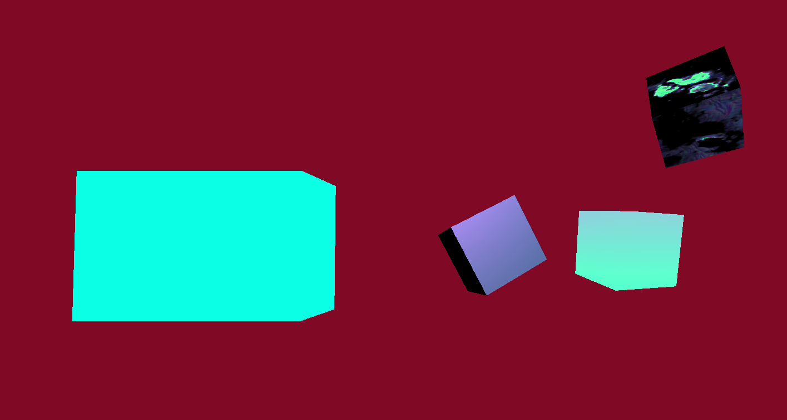

Cube with shaders video link: https://drive.google.com/file/d/1I--A6AGeBcJIa3EtbBhMMYEW0mm5JxCV/view?usp=sharing

# How I made the cubes, left to right.

For the first cube, the effect of the shader is not visible in the photo. You need to view the video to see. The cube flickers between light blue and white. I used a sin function in the fragment shader that uses the current time in the computer system as an input for the color. Within the html script section, I have a delta that is slight increasing each frame in the animation. This is what creates the faded flicker vs a straight two color flicker.

For the second cube, I used the three.js built in Phong shader. In the parameters when I created the instance of the cube, I set the a base color, a specular color and the shininess value to my desired aesthietc.

For the third cube