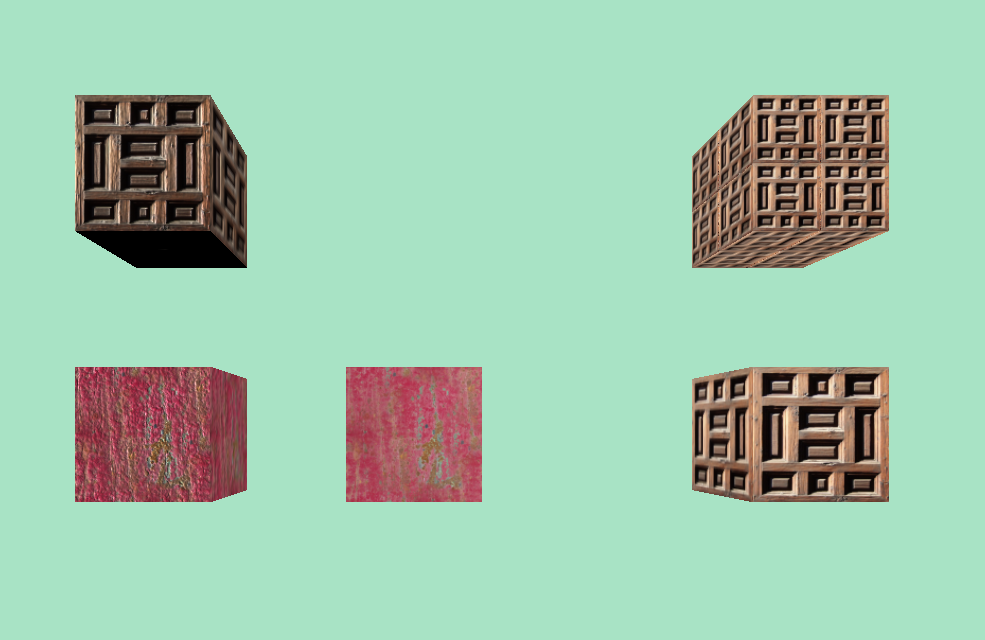

cubes video link: https://drive.google.com/file/d/1BlCNwq3zuWUB0NIypOI7ek4J6SX1H8CX/view?usp=sharing

# Desciption of Cubes
**Top row:**
**Left** - followed the lab isntruction and applied a texture map and noraml map using THREE.js built in shaders
**Right** - created this tiled textured cube via a fragment shader. To tile the texture into 4 quadrants, I added if statements for each quadrant, splitting the values up by the uv coordinates of 0.5. For example, if(uVu.x > 0.5 && uVu.y < 0.5>) would map to the bottom left quadrant, and if (uVu.x > 0.5 && uVu.y > 0.5) would map to the top right quadrant, etc. After this, I need to scale down the texture that I placed in each of these if statements so I would get 4 scaled down textures filling in the cube. To scale the texture, I multipled the uv coordinate I was currently at by 2.0. Depending on which quadrant/if statement I was in, I need to correct for the starting position of the coordinate in which to scale the texture up from, so that way the texture would always scale up from the (0, 0) spot, therefore being uniform.

**Bottom Row:**
**Left** - followed lab instruction to use a texture map and normal map to show how the light refracts off the cube as compared to the cube to the right
**Middle** - followed inital lab instructions; this cube only has a texture applied, so the light evenly hits the cube as it swings rotates around the cube
**Right** - created a cube following lab instructions; this cube has the texture applied via the fragment shaders, so the THREE.js does not affect it

# Lab 4 Questions:

a) x = floor(u * 8)

b) y = floor( (1 - v) * 8) 

I have floor function bounding the equations for a and b since the pixels must be whole numbers.

c) (0.375 * 8) = 3
   (1 - 0.25) * 8 = 6
   (3, 6) => white