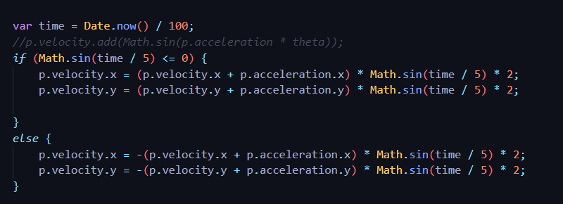

Part 2a static particles video: https://drive.google.com/file/d/10cD5rQiqxpsuZ1nmAuFJOOprTDt6ES9d/view?usp=sharing

Part 2b exploding particles video: https://drive.google.com/file/d/1qm6aleTBvgEwjcE6JwM2XG9cmibWACKL/view?usp=sharing

# Custom Particle Animation: https://drive.google.com/file/d/1zActsVBxZxOWwdDOZq6tY_CXxpYOQWDw/view?usp=sharing

For my custom particle animation, I played with the sin function to create a cluster of randomly colored billboards that expand and contract in a circle in a consistent timing pattern. Thos create a slower pulse, I made sure to fivide the inside of my sine function by a number, rather than multiplying. I use time to get a randomized value, so each pulse and contraction is slightly differed.