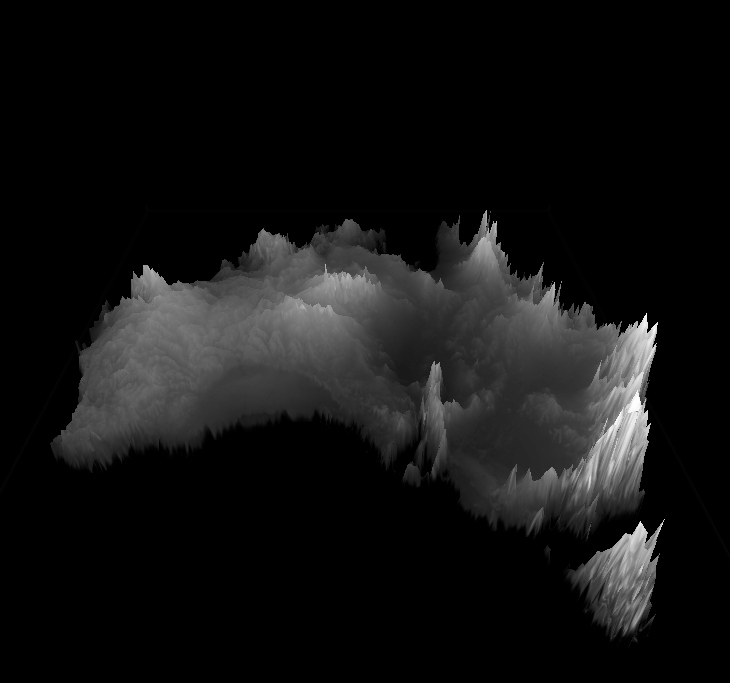
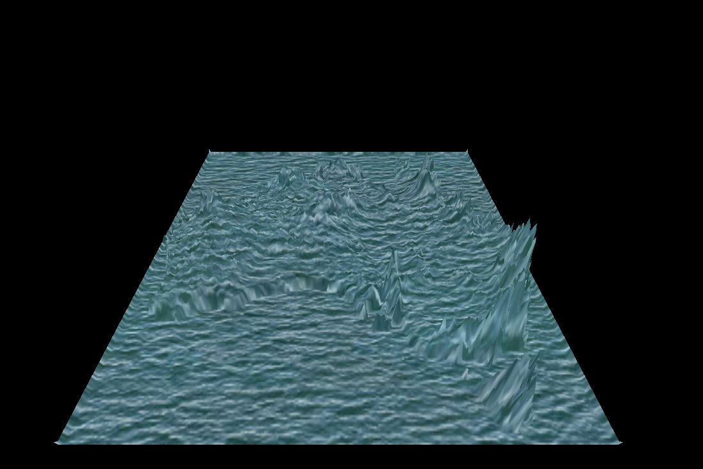
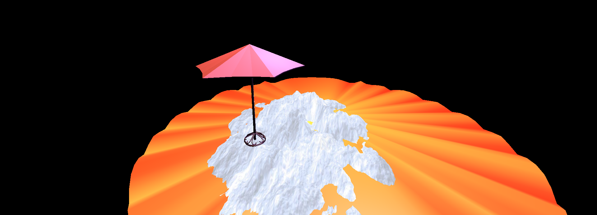

# Part 2a
terrain with height map as texture:

terrain with a water texture: 

# Part 2b
animated waves video: https://drive.google.com/file/d/1VG7zFHvWqpTJ-m08DYMj5OrSDZsW-w4a/view?usp=sharing

# Part 2c
screenshot:

link to animated video:
https://drive.google.com/file/d/1iSaV15Iw3vloGUS2PuPEzy4PoVUMSftm/view?usp=sharing

# Partner
My partner Preet decided to use the volcano height map and colors texture to create a mountain-like area and a beach next to it. I played around with the positions and scaling of the volcano heightmap to create a mountain and beach. They also decided to make the scene unrealistic and make it colorful so hence the colorful mountains, beach, and ocean.