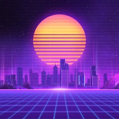
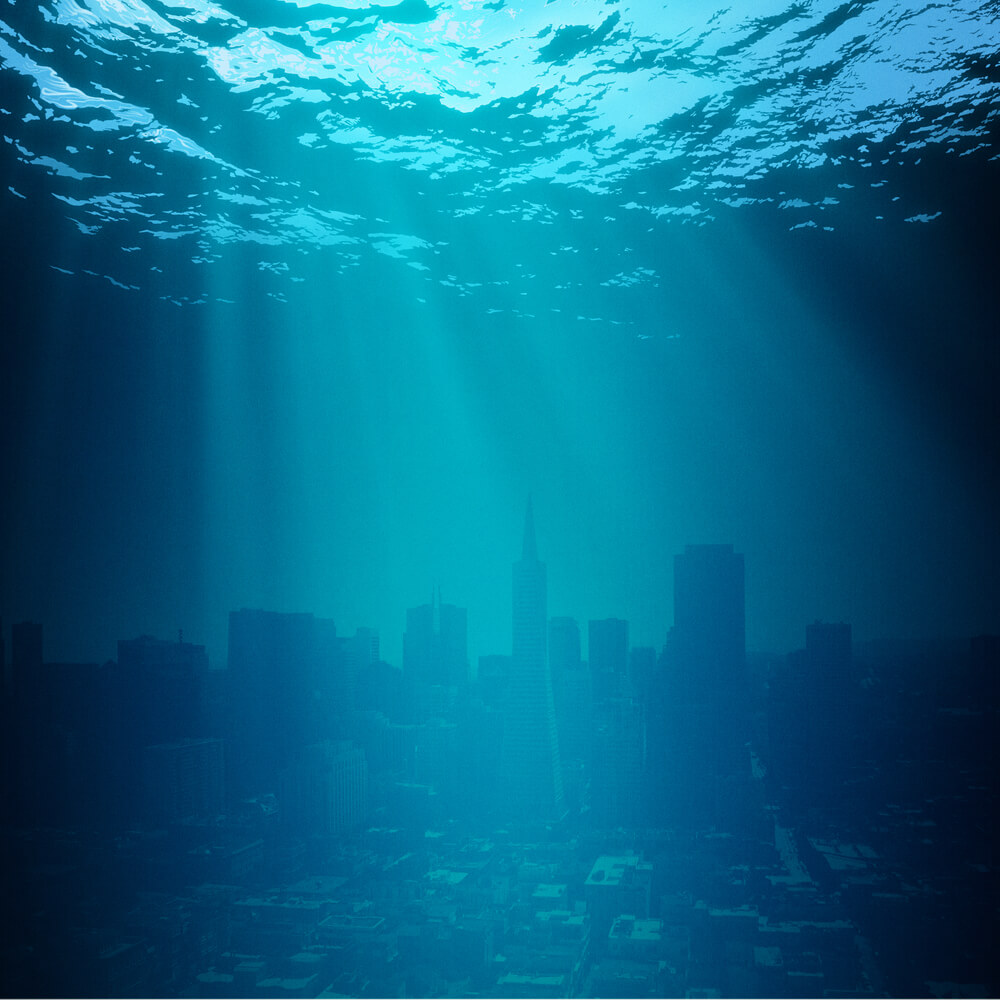
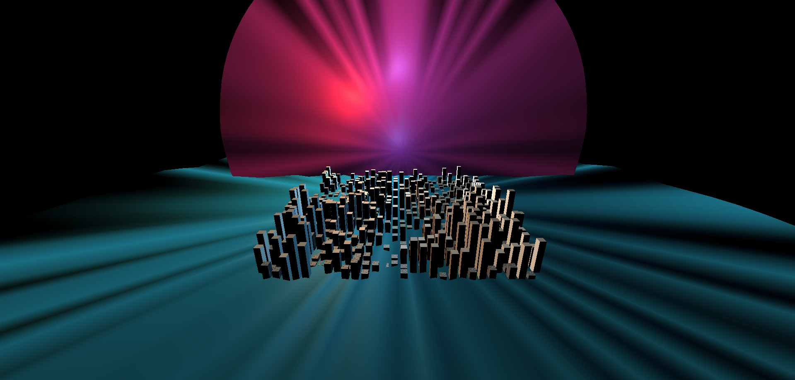
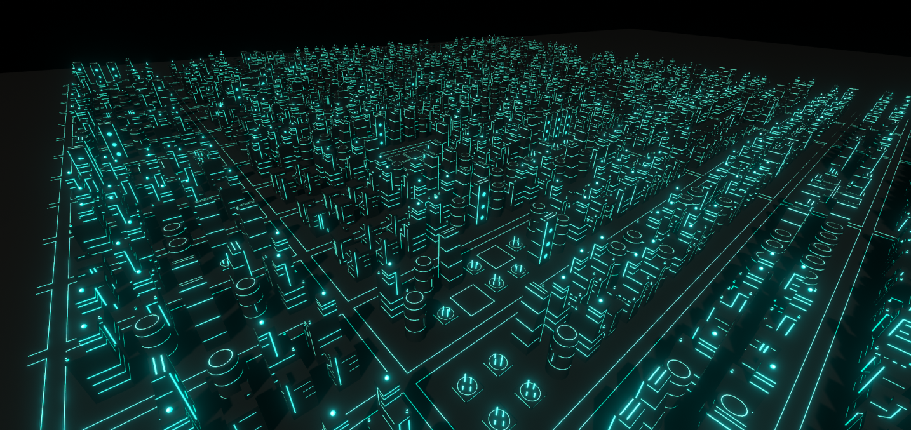

# City Inspirations

# Generated City

video: https://drive.google.com/file/d/1lRFH4ujXkPrfTJUptMW7UYGUHyB2PvFF/view?usp=sharing

# City explanation
I combined ideas from two seperate city aethstics I like, the 90s/neon vibe and the atlantis/underwater look. I wanted to use the movement of the flor mat as water waves to see the water sort of overflow the floor of the city, so you can see building appear and dissapear. I wanted to add the sun icon usually associated with that nneon aesthetic, so I placed an animate mat with sunset colors. To help enhance that image onto the buildings, I added a few lights with different intensities and colors to help shape the city buildings with a back-light aesthetic. Also, since I varied the textures and colors of the city buildings based on their height, the lights reflect differently on the different textures/colors, which helps create variation.

# Partner

My partner Hermon did the Unity portion of the lab. He found the tutorial pretty straight foward to follow. He noted that  the handling of the rules of the mapGrid data structure was interesting. We completed our labs seperately.